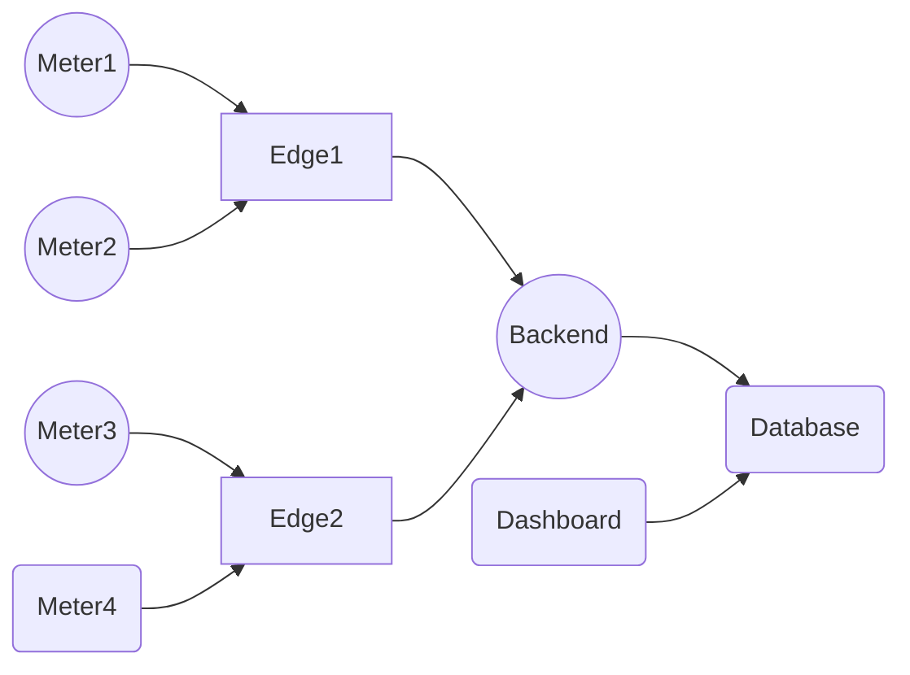

```mermaid
graph LR; 
Meter1((Meter1)) --> Edge1[Edge1]; 
Meter2((Meter2)) --> Edge1[Edge1]; 
Meter3((Meter3)) --> Edge2[Edge2]; 
Meter4(Meter4) --> Edge2[Edge2]; 
Edge1[Edge1] --> Backend((Backend)); 
Edge2[Edge2] --> Backend((Backend)); 
Backend((Backend)) --> Database(Database); 
Dashboard(Dashboard) --> Database(Database); 
```